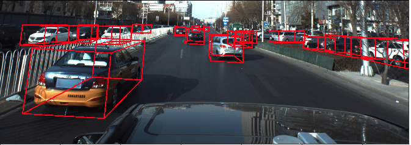
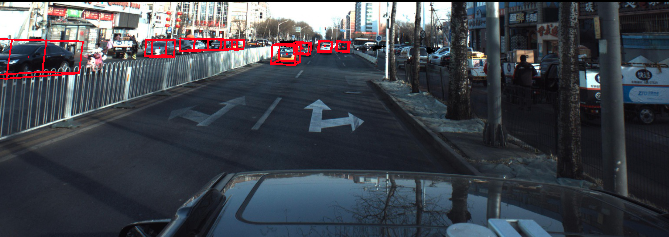

# Peking University/Baidu - Autonomous Driving
This repo is the source code of my solution in [Peking University/Baidu - Autonomous Driving](https://www.kaggle.com/c/pku-autonomous-driving/).  
The main architecture of this solution is CenterNet, which is a very great work from [Objects as Points](https://arxiv.org/abs/1904.07850).  
 
 
## Overview
 
The main task of this competition is to detect the cars on the street. The detection task is not just on 2D coordinate, but 3D world coordinate.  
So the ground truths of this competition are the 3D rotation angles(Pitch, Yaw and Roll) and world coordinate corresponding to the data collection camera.  
With these information, we can know the distance between cars, and how the cars are going to turn.  
 
 

## Data augmentation

 

**1. Random Gamma**  
**2. Random brightness**  
**3. Random contrast**  
**4. Gaussian noise**  
**5. Blur**  
**4. Horizontal flip**  
**5. Camera rotation**  

 

Camera rotation is added after the comptition, this is a very important augmentation techique in this competition.  
And this augmentation techique is shared by a person who won the first place - [outrunner](https://www.kaggle.com/outrunner) in this compeititon.  
Since there are only around 4000 pictures for training, so camera rotation is a great way to expand the training dataset.  

## Model architecture

I trained 4 models for this competition, and ensemble them in the end to be my final submission answer.  
There are: 
 

**1. CenterNet(UNet++ decoder) with efficietnet B3 backbone**  
**2. CenterNet(msra decoder) with efficietnet B2 backbone**  
**3. CenterNet(msra decoder) with efficietnet B3 backbone**  
**4. CenterNet(msra decoder) with efficietnet B4 backbone**  
 
I changed the decoder to UNet++ in the last few days. It can provide better mAP score, but the training time is also longer.  
All the models have the same prediction heads, there are :  
 
**1. Heatmap head (for keypoint detection)**  
**2. Rotation head (for Yaw, Pitch and Roll regression)**  
**3. Depth head (for distance regression)**  

 

The implementation of Rotation head came from a great public [kernel](https://www.kaggle.com/hocop1/centernet-baseline) in this competition.  
And the heatmap and depth heads came from the original article of CentetNet.  
But there is a different between my implementation and original article, I performed the sigmoid activation on output of heatmap head.  
This change can make the training much stable.  
 

## Loss functions
 
**Focal Loss for heatmap head**
**L1 Loss for rotation and depth head**
The total loss is sum by some weightings of these 3 losses, which are `0.1 : (0.9)*1.25 : (0.9)*1.5 = heatmap_loss : rotation_loss : depth_loss`  
 

## Training recipe
 

**Training data : 80% of original dataset, validation data  : 20% of original dataset**.  

(I didn't perform k-fold training, so there is no hold-out dataset.)   

**Total training epochs : around 40-50 epochs**  

**Intital learning rate : 6e-4**  

**Optimizer : Adam optimizer**  

The weightings of each loss are coming from many trials of training, which I add the all the losses into metric.  
After I settled down the weightings, I discard the validation on losses of validation dataset.  
Instead, I use the prediction of validation dataset to calculate the mAP in the end of every epoch, and use the mAP score to be the monitering metric of training.  
The learning rate is decreased by x = x*0.5 if the validation mAP didn't improve in 2 epochs.  
 

## Demo 
 

 

 

## Reference

 
[Object of points](https://arxiv.org/abs/1904.07850)  
[Original CenterNet github repo](https://github.com/xingyizhou/CenterNet)  
[CenterNet github repo](https://github.com/xuannianz/keras-CenterNet)  
[CenterNet public kernel - 1](https://www.kaggle.com/hocop1/centernet-baseline)  
[AR public kernel - 2](https://www.kaggle.com/ebouteillon/augmented-reality)  
[Metrics public kernel -3](https://www.kaggle.com/its7171/metrics-evaluation-script)  
[3D visualization public kernel - 4](https://www.kaggle.com/zstusnoopy/visualize-the-location-and-3d-bounding-box-of-car)  
[Camera rotation public kernel - 5](https://www.kaggle.com/outrunner/rotation-augmentation)  